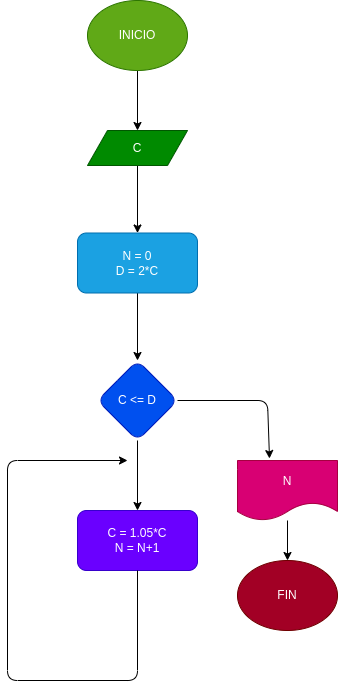

# interes_compuesto
hacer el diagrama de flujo y elprograma en python, que lea un capital C, y que averigue el prima en cuantos meses se duplica si lo colocamos a un interes compuesto del 5% mensual  

# ANALISIS
Variables de entrada
C = capital inicio

Variables de proceso
C = 1.05*C
N = N+1

Variables de salida
N = numero de meses en total

# DISEÑO 

